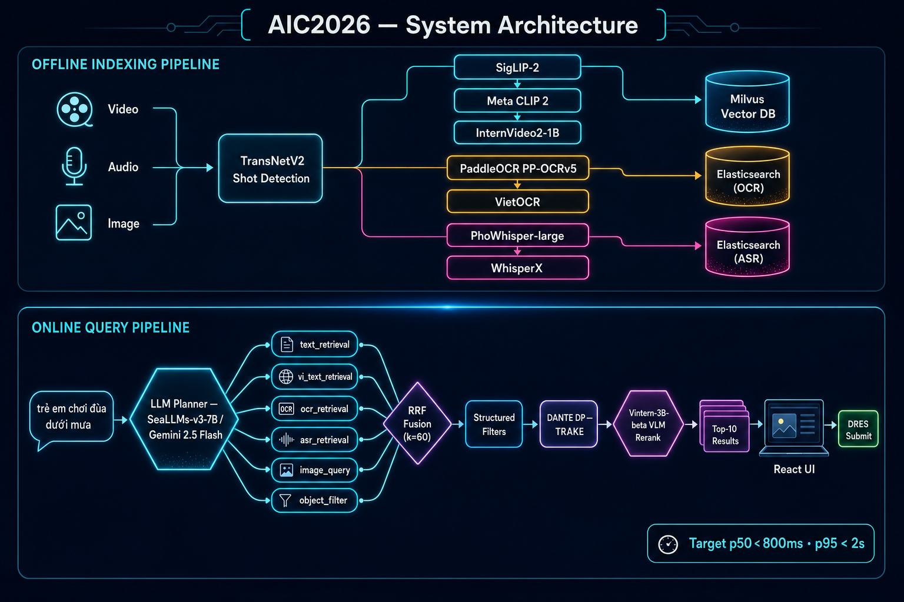
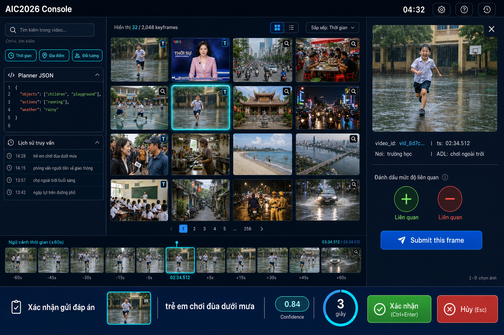
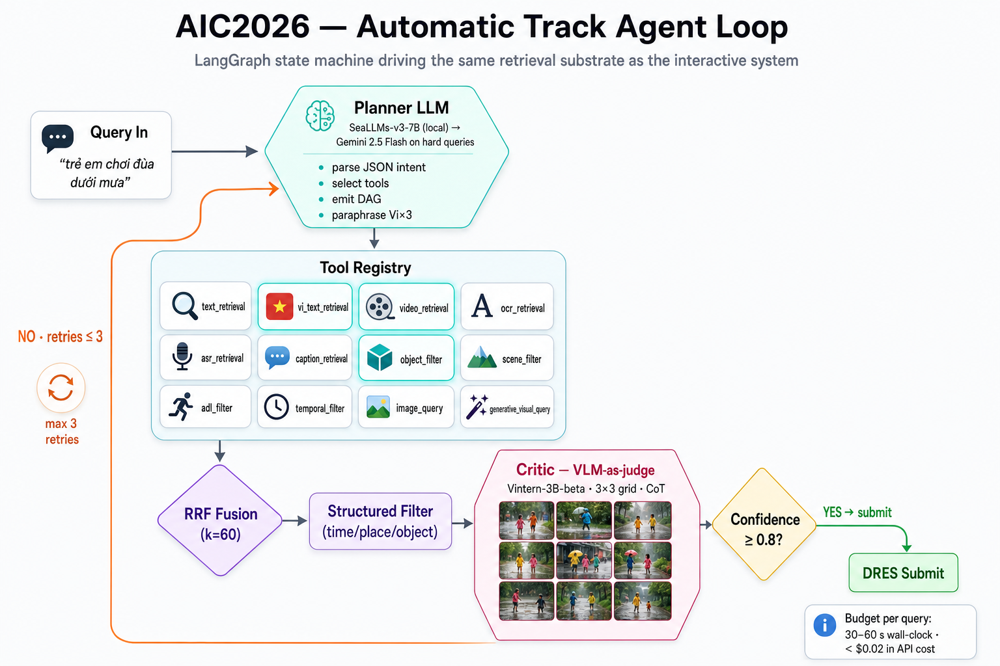
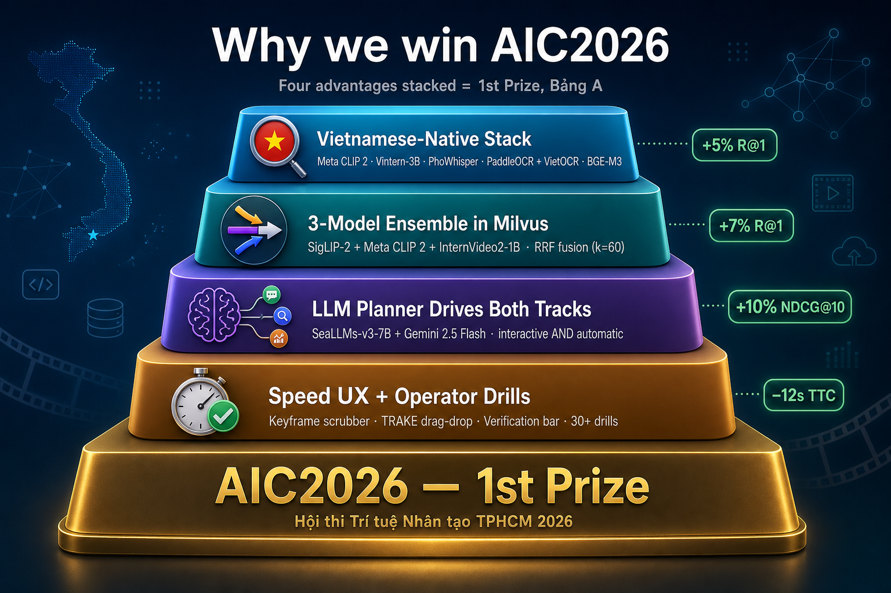

# Illustrations - for team discussion

> Four diagrams to anchor team discussions about the AIC2026 strategy and architecture. All AI-generated as conversation starters - the team should mark them up, debate the choices, and replace any inaccuracies before they ship to a slide deck.

## 1. System Architecture - `aic2026-system-architecture.png`

What this shows: the full **offline indexing pipeline** (top) and **online query pipeline** (bottom) in one view.

Discussion prompts for the team:
- Do we agree on the three image encoders (SigLIP-2, Meta CLIP 2, InternVideo2-1B)? Should we replace InternVideo2 with V-JEPA-2 or LanguageBind?
- One Milvus, two Elasticsearch indexes - or fold everything into Milvus hybrid?
- Should the planner LLM also be in the offline pipeline (for caption generation)?
- Where does the audio-events (CLAP) lane fit? Add a fourth pipeline?

Reference: `docs/proposals/01-interactive-system-architecture.md`.

## 2. UI Mockup - `aic2026-ui-mockup.png`

What this shows: the React operator console in dark mode. Grid, planner JSON panel, query history, keyframe scrubber, frame-detail slideout, and the submission-verification bar.

Discussion prompts for the team:
- 8x4 grid vs 8x6 (more rows = smaller thumbnails, more context)?
- Is the Planner JSON panel a feature (operator sees the reasoning) or a distraction (clutter)?
- Where do we surface the Vietnamese ASR/OCR snippets for the selected frame - inline below thumbnail, in a tooltip, or only in the detail slideout?
- TRAKE mode is NOT shown here - we need a separate mockup for the 4-scene drag-drop staging tray.
- Is the verification bar countdown set correctly (3 seconds)? Different value for operator vs novice mode?

Reference: `docs/proposals/06-ui-ux-design.md`.

## 3. Automatic Track Agent Loop - `aic2026-agent-loop.png`

What this shows: the LangGraph state machine for the autonomous-agent track. Planner -> Tool Registry -> RRF -> Structured Filter -> VLM Critic -> Confidence gate -> Submit or Retry.

Discussion prompts for the team:
- 12 tools is what we sketched - are any missing (sound-event search via CLAP)? Should we drop generative_visual_query in MVP and add it in Phase 2?
- Confidence threshold 0.8 is a guess - how do we choose it? See `docs/proposals/05-evaluation-harness.md` SS 9 on Platt calibration.
- 3 retries: too many (wastes time budget) or too few (gives up on hard queries)? Maybe make it adaptive based on remaining wall-clock.
- Should the critic VLM also be allowed to *modify* the plan, not just score it (Reflexion-style)?

Reference: `docs/proposals/02-automatic-track-agent.md`.

## 4. Winning Hypothesis Stack - `aic2026-winning-stack.png`

What this shows: the four stacked advantages we believe will win 1st prize, with notional cumulative gains.

Discussion prompts for the team:
- The "+5% / +7% / +10% / -12s" numbers are **placeholders** - we need to replace them with real numbers from the eval harness in Phase 2.
- Did we miss an advantage? E.g. "synthetic-caption fine-tuning" or "Vietnamese transcript-cleanup" could each be its own tier.
- Is "operator drills" really the right framing for the bottom tier, or should it be "UX latency" alone?
- This is the slide we present to organisers / press if we win. Get the visual right before September.

Reference: `docs/strategy/00-master-strategy.md` SS 2.

---

## How these were made

Generated via AI image-gen tool on 2026-05-24 from detailed prompts informed by the strategy and proposals docs. They are **starting points for team discussion**, not final assets. As decisions firm up, replace these with Figma-authored versions for the press kit / slide deck.

Open them in your image viewer at 100% to read the labels.
